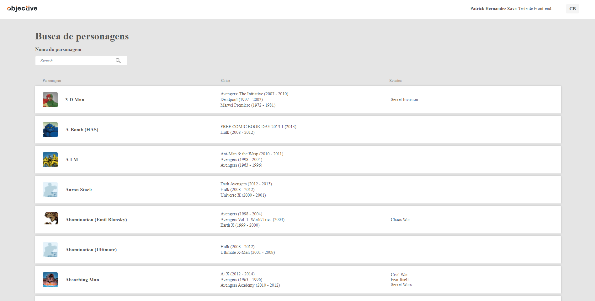
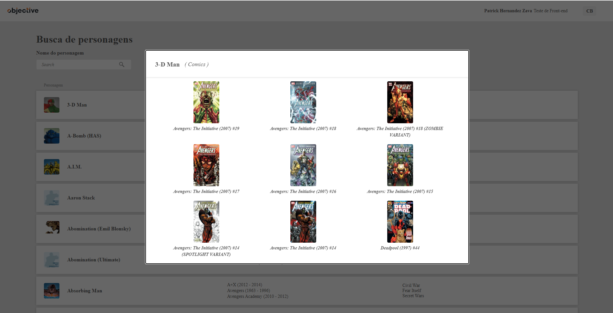
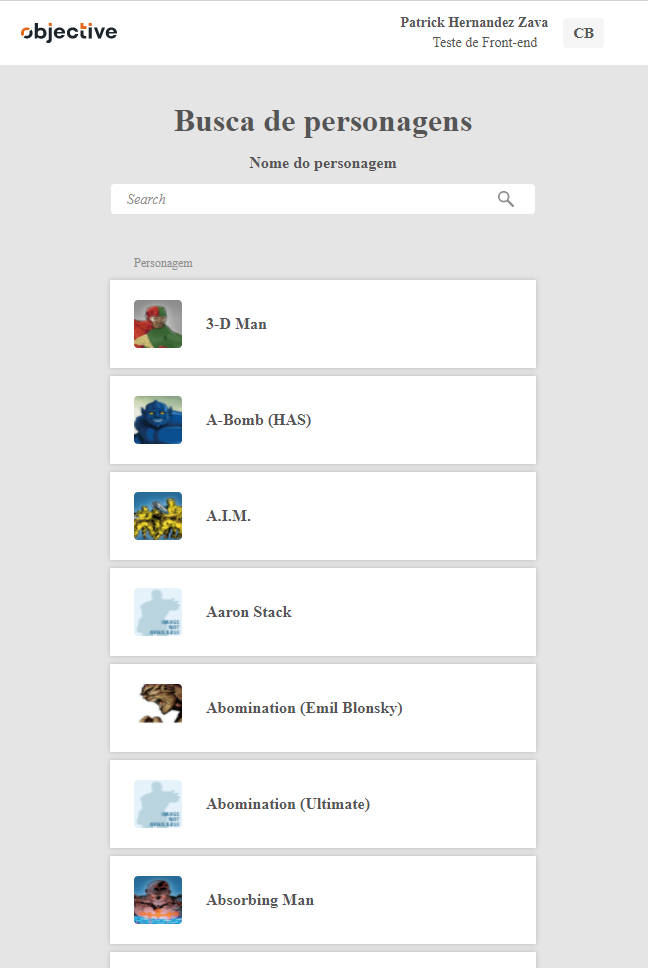

<h1 align="center">
     🦸 <a href="#" alt="projeto code hero">Projeto Code Hero</a>
</h1>

## 💻 Sobre o projeto

Projeto Code Hero - é uma atividade técnica desenvolvida pela empresa <a href="https://www.objective.com.br/" alt="Objective">Objective</a> afim de avaliar as habilidades técnicas com foco em desenvolvimento web, utilizando ReactJS. 

O projeto consiste em fazer uma aplicação responsiva, que é dividida em duas partes, para mostrar informações sobre personagens disponibilizados pela API da <a href="https://developer.marvel.com/" alt="API Marvel">Marvel</a>.

---

## ⚙️ Funcionalidades

- [x] Listagem:
  - [x] Mostra uma lista com os personagens e suas descrições
  - [x] A listagem deve ter 10 personagens por página
  - [x] Para telas pequenas, mostrar apenas os personagens, sem suas descrições
  - [x] Deve ser possível buscar os personagens por nome
  - [x] Deve ser possível navegar entre as páginas da tabela
  - [x] Ao selecionar um personagem, mostrar mais informações sobre ele no “Detalhe” 

- [x] Detalhe:
  - [x] Deve ter pelo menos uma listagem de mídias em que o personagem participou, com título e imagem. Você pode adicionar o que mais achar relevante e interessante

---

## 🎨 Layout


### Web

<p align="center" style="display: flex; align-items: flex-start; justify-content: center;">
  

  
</p>

### Tela pequena
<p align="center" style="display: flex; align-items: flex-start; justify-content: center;">
  
</p>

---

## 🚀 Como executar o projeto

### Pré-requisitos

Antes de começar, você vai precisar ter instalado em sua máquina as seguintes ferramentas:
[Git](https://git-scm.com), [Node.js](https://nodejs.org/en/). 
Além disto é bom ter um editor para trabalhar com o código como [VSCode](https://code.visualstudio.com/)

#### 🎲 Rodando a aplicação web (Frontend)
```bash
# Clone o repositório
$ git clone git@github.com:PatrickZava/teste-front-end.git

# Acesse a pasta do projeto no seu terminal
$ cd teste-front-end

# Instale as dependências
$ npm install

# Execute a aplicação em modo de desenvolvimento
$ npm run start

# A aplicação estará rodando na porta:3000 - acesse http://localhost:3000

```
---

## 🧑 Autor

 
 <br />
 <sub> 💻 <b>Patrick Hernandez Zava</b></sub> 
 <br />

 [](https://www.linkedin.com/in/patrick-zava/) 
[](mailto:patrickzava@gmail.com)
